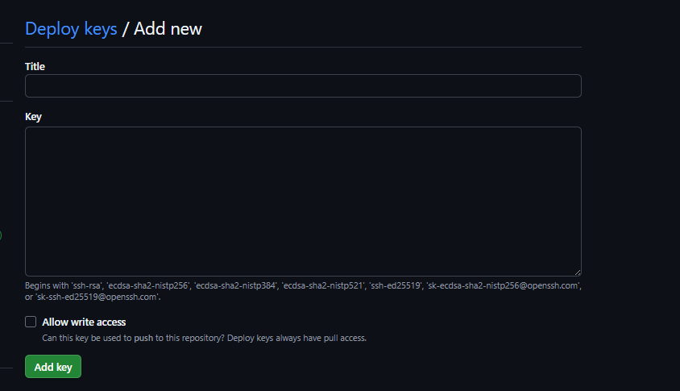

# Guide to Python Automation on Raspberry Pi 4B: From Development to Cron Scheduling

## Introduction

This report serves as an expert-level guide for commissioning a Raspberry Pi 4B as a robust, dedicated automation platform. The analysis follows a specific, multi-layered technical workflow:

- Foundational Setup: Commissioning the Raspberry Pi 4B hardware and operating system.
- Core Logic: Developing Python scripts within modern, isolated virtual environments.
- Execution Layer: Encapsulating these Python scripts within durable Bash scripts.
- Automation Engine: Automating the entire process using the cron scheduling daemon. The primary challenge in this architecture—and thus the central focus of this guide—is navigating the critical, yet often-misunderstood, environmental disconnect between an interactive user terminal and the non-interactive, minimal-context environment used by the cron scheduler. 

## Part 1: Foundational Setup: Commissioning the Raspberry Pi 4B

The first stage involves preparing the Raspberry Pi hardware and installing a clean, secure operating system (OS) configured for automated, headless operation.

### Module 1.1: Operating System Installation

The recommended method for OS installation is the official Raspberry Pi Imager.This tool, available for Windows, macOS, and Linux, simplifies the process of downloading and flashing an OS image to a microSD card.  

Choosing the Correct Operating System
You're going to want to choose the 64 bit Raspberry Pi OS.  It'll look like this


The first time the system boots, you'll think its running extremely slowly and reconsider whether the 32 bit option was maybe the choice.  Give it a little time. The install process for Linux is slightly different in that its optimizing path structure as its building the first time on the fly.  So it takes a little extra compute to get the job done. 

### Module 1.2: WIFI / SSH / timezone setup

A headless setup (lacking a monitor, keyboard, or mouse) is standard for an automation server. The Raspberry Pi Imager provides a modern, integrated method for pre-configuring the OS for SSH access.

#### Advanced Options Menu
Historically, enabling SSH on a headless Pi required mounting the flashed SD card and manually creating an empty file named ssh in the boot partition. This method is now obsolete for initial setup.

The Imager features an advanced options menu, accessible by pressing CTRL + SHFT + X 11 or clicking the gear icon. This menu is the key to a true zero-touch headless configuration. Before flashing the SD card, this menu allows the administrator to:
- Set a hostname (e.g., my-pi)
- Enable SSH permanently
- Create a user account and set a secure password
- Pre-configure Wi-Fi credentials (SSID and passphrase)
- Set your time zone (for CRON jobs)
- This process embeds the configuration into the image, allowing the Pi to boot, connect to the network, and be immediately accessible via SSH on its first boot.


As a backup for the above config. If, after the first boot, the Pi is not accessible via SSH (e.g., ssh username@raspberrypi.local times out), the first troubleshooting step is to power down the Pi, mount the SD card on a computer, and manually add the empty ssh file to the root directory of the boot partition. This manual override often resolves the connection failure.

### Module 1.3: First Boot and System Hardening

Once the Pi is booted and connected to the network, the first action is to connect to it via an SSH client (like PuTTY on Windows 9 or the built-in terminal on macOS/Linux) and perform initial system updates.

```bash
ssh username@raspberrypi.local | ssh username@<IP_ADDRESS>
$ sudo apt update
$ sudo apt full-upgrade
```

#### System Software Updates
The first commands to run on any new Linux system are to update the package lists and upgrade all installed software. This ensures the system is secure and all packages are at their latest versions.

#### Update Package Lists
This command downloads the latest package information from the repositories defined in /etc/apt/sources.list. It does not install or upgrade any software.

#### Upgrade System Packages:
This command performs the actual upgrade of all installed packages. It is critical to use full-upgrade rather than the more common apt upgrade. The upgrade command will never remove existing packages, even if removal is required to resolve a dependency conflict. The full-upgrade command will remove packages if necessary to complete a system-wide upgrade. After updating, the raspi-config tool `sudo raspi-config` can be run to set system-level options like the timezone, which can be important for cron scheduling or if you didn't set it at the point of image creation.

## Part 2 Enviroment management. 

Lots of different schools of thought here but I stick with poetry and venvs.   The commands to replicate with such tools can be found here.  First and foremost make sure you're storing your venvs locally to your project folder. 

```python
poetry config virtualenvs.in-project true
```

To create your venv 
```python
poetry env use python

or

python -m venv .venv
#Windows
.venv\scripts\activate
#Mac-Linux
source .venv/bin/activate
```

Either should create and activate your environment in your terminal. If you cloned this repo, you just need to do the following to install the necessary libraries.  

```
poetry install --no-root
```

Or you can install the listed libraries above manually with pip.  Detailed can be found in the `README.md` for this repo.

- numpy  |  2.3.4  
- psutil |  7.1.3  
- rich   |  14.2.0

## Part 3: The Execution Layer: Python in Bash

The next layer in the architecture is the Bash script. This script acts as the entry point for automation, handling environment setup before executing the Python logic.

### Module 3.1: Fundamentals of Bash Scripts

A Bash script is a plain text file containing a series of shell commands. It always starts with `#!/bin/bash` This is a "hardcoded" path to the Bash interpreter. The Shebang The very first line of a Bash script must be a "shebang" It is common but less portable. `#!/usr/bin/env bash` is the preferred, portable shebang. It uses the env program to find the bash executable in the user's $PATH, which is more flexible.

#### Executable Permissions
By default, a new text file is not executable. The chmod (change permissions) command must be used to grant executable permissions.
```bash
chmod +x scripts/run_script.sh
chmod +x logs/cron.log
chmod +x .venv/bin/python
```

We don't necessarily need to set the permissions for the python log files as those won't need execution permission.

### Module 3.2: Calling Python from Bash (The Right and Wrong Ways)

The primary job of the wrapper script is to execute the Python script within its correct virtual environment. There are two common methods to achieve this:

#### Method 1 (The "Interactive" Way)
Sourcing the activate script. This method mimics what a human user does in their terminal.

```bash
#!/usr/bin/env bash
source /home/username/pyonrpi/.venv/bin/activate
python3 main.py
deactivate
```

#### Method 2 (The "Direct Call" Way)

Calling the venv's Python binary directly. This bypasses "activation" and simply executes the script using the specific Python interpreter from the venv's bin directory.

```bash
#!/usr/bin/env bash
/home/username/pyonrpi/.venv/bin/python3 /home/username/pyonrpi/main.py
```

### Critical Recommendation for Automation
A deep analysis of the cron environment reveals a critical, non-obvious flaw in Method 1.  The cron daemon's default shell is, on most Linux systems, /bin/sh.
The source command (used in Method 1) is a Bash-specific feature (a "bashism").
The /bin/sh interpreter does not understand the source command. Therefore, a bash script using source (Method 1) will fail when executed by the default cron shell.
Method 2 (the "Direct Call" way) makes no assumptions about the shell's features. 

It is a simple, direct executable call, which /bin/sh handles perfectly. Method 2 is vastly superior, more robust, and more portable for automation. It is the architecturally correct choice for this workflow. While Method 1 can be forced to work by changing cron's default shell (by adding SHELL=/bin/bash to the crontab), this is an unnecessary and brittle dependency.

#### Module 3.3: The Canonical Bash Wrapper Script

A truly robust wrapper script must, like its Python counterpart, be location-aware. It cannot assume it is being run from a specific directory, especially when called by cron. The Bash equivalent of Python's __file__-based path is achieved using dirname and readlink. 

#### Bulletproof Bash Wrapper (run_script.sh):

This script is designed to be run from anywhere (e.g., $HOME by cron) and will still work.

```bash
#!/usr/bin/env bash

# set -e
# This command is crucial. It causes the script to exit immediately
# if any command fails, preventing subsequent commands from running.
set -e

# 1. Get the absolute directory where this script is located.
# This makes the script location-agnostic and immune to CWD problems.
SCRIPT_DIR=$(dirname "$(readlink -f "$0")")

# 2. Define absolute paths to the venv Python and the script to run.
VENV_PYTHON="$SCRIPT_DIR/.venv/bin/python"
PYTHON_SCRIPT="$SCRIPT_DIR/scripts/main.py"

# 3. Add a check to ensure the venv executable exists.
if; then
    echo "Error: Virtual environment Python not found at $VENV_PYTHON"
    exit 1
fi

# 4. Execute the Python script using the robust "Direct Call" method.
echo "Bash Wrapper: Starting Python script at $(date)..."
"$VENV_PYTHON" "$PYTHON_SCRIPT"
echo "Bash Wrapper: Python script finished at $(date)."
```

This script is now a self-contained, robust automation unit, immune to $PATH and CWD issues, and ready for scheduling.

## Part 4: Automation - Scheduling with Cron

The final layer is the cron daemon, the time-based job scheduler built into Linux.55

### Module 4.1: Introduction to the Cron Daemon

cron is a background daemon (service) that continuously checks for scheduled tasks. The list of tasks is stored in a file called the crontab (cron table).Each user on the system has their own crontab. 

#### Editing the Crontab 

The crontab file should never be edited directly.58 The crontab command is used to safely edit it.
```bash
$ crontab -e: #This is the command to edit the current user's crontab.55 It will open the file in the system's default text editor (e.g., nano)
$ crontab -l: #Lists all jobs in the current user's crontab.
$ crontab -r: #Removes all jobs from the current user's crontab. Use this command with extreme caution.
```

#### User Crontab vs. Root Crontab
It is a common mistake to edit the root user's crontab using $ sudo crontab.  This is unnecessary and dangerous from a security "principle of least privilege" perspective. Since the entire project (Python scripts, venv, Bash wrappers) is located in the pi user's home directory (/home/pi), the automation job should run as the pi user.  Therefore, the correct command to use is `crontab -e` (with no sudo).

#### Module 4.2: Crontab Syntax and Scheduling

A cron job definition has two parts: the schedule and the command. The schedule is defined by five fields, often represented as five asterisks:

```
* * * * * [command-to-run]
```
#### Operators

The fields represent, in order:
- Minute (0 - 59)
- Hour (0 - 23, 24-hour clock)
- Day of Month (1 - 31)
- Month (1 - 12)
- Day of Week (0 - 6, where Sunday is 0)
- The asterisk (*) is a wildcard meaning "every"

#### Special Operators

, (Comma): Specifies a list of values (e.g., 0 8,12,16 * * * runs at 8:00, 12:00, and 16:00).61
- (Hyphen): Specifies a range (e.g., 0 9 * * 1-5 runs at 9:00 AM on weekdays).44
/ (Slash): Specifies a step value (e.g., */10 * * * * runs every 10 minutes).56

#### Special Strings

For convenience, cron also provides human-readable shortcuts.56
@reboot: Run once at system startup.36
@hourly: Runs at the beginning of every hour (same as 0 * * * *).57
@daily: Runs at midnight (same as 0 0 * * *).57
Table 2: Crontab Syntax Examples

| Desired Schedule                       | Crontab Syntax   |
|----------------------------------------|------------------|
| Every 5 minutes                        | */5 * * * * 61   |
| Every day at 2:30 AM                   | 30 2 * * * 57    |
| Every hour, on the hour                | 0 * * * * 57     |
| Weekdays (Mon-Fri) at 5:00 PM (17:00)  | 0 17 * * 1-5 67  |
| Twice a day (8:00 AM and 8:00 PM)      | 0 8,20 * * *     |
| On the 1st and 15th of every month     | 0 0 1,15 * * 65  |
| Every Sunday at midnight               | 0 0 * * 0 57     |

## Part 5: Deploy keys

Now that we've gotten most of our setup in order the last step is adding the deploy key to our repo.  Normally in this situation you'd want to only give read access to a repo pull for safety.  Here we're going to be a bit more brazen and let the bash script perform a git pull/commit/push all on its own to update our files.  Which for our case will only be the daily json files. TThe first thing you'll need to do is create an SSH key to share with github

```terminal
ssh-keygen -t ed25519 -C "rp4_deploy_key" -f "$HOME/.ssh/rp4_deploy_key"
```

-t ed25519: Creates a modern, secure key.
-C "...": A comment to help you remember what this key is for.
-f "$HOME/.ssh/rp4_deploy_key": Saves the private key to rp4_deploy_key and the public key to rp4_deploy_key.pub inside your .ssh directory.

### Crucial
When it asks for a passphrase, press Enter twice to leave it empty. Why? This script is for automation. If the key has a passphrase, the script will get stuck asking for it, which defeats the purpose.

Next, you'll also want to add your key to your repository.  Navigate to `settings` -> `deploy keys` -> `add deploy key`


To copy the pub key
```
cat "$HOME/.ssh/rp4_deploy_key.pub"
```

Now paste that into the key field below and give it a useful title like.  `Cron_comp_stats`.  Click allow write access if you want this repo to be pushing data back up to github.



Next you'll tell your ssh config file where to look for that ssh key when it asks for it.  

```terminal
nano "$HOME/.ssh/config"
```

Add the following block of text to the file. (If you use a provider other than GitHub, change HostName.)

# Config for RP4 deploy key
```
Host github.com-pyonrpi (or your reponame)
    HostName github.com
    User git
    IdentityFile ~/.ssh/rp4_deploy_key
    IdentitiesOnly yes
    AddKeysToAgent yes
```

Lastly, you'll set up your git remote origin to point at the hostname you just assigned to your SSH file.  

Do so by first checking your remote 
```
git remote -v
```

To reset it to your repo

```
# Format: git remote set-url [remote_name] git@[HOST_ALIAS]:[USERNAME]/[REPO].git
git remote set-url origin git@github.com-pyonrpi:Landcruiser87/pyonrpi.git
```

This will point any SSH request from your repo, to the appropriate git url with your deploy key

## WARNING
This not a secure practice.  But if you want full hands off automation, this is the way to do it!  Thanks for coming~

Now we can set up our cronjob as described earlier.  Say I want this to run every 10 seconds.  
That would be

```
0/10 0 * * * /bin/bash $HOME/gitrepos/pyonrpi/run_script.sh >> $HOME/gitrepos/pyonrpi/logs/cron.log
```

Also this is a nice reference site for explaining cronjobs in more detail.
[CronGuru](https://crontab.guru/)

